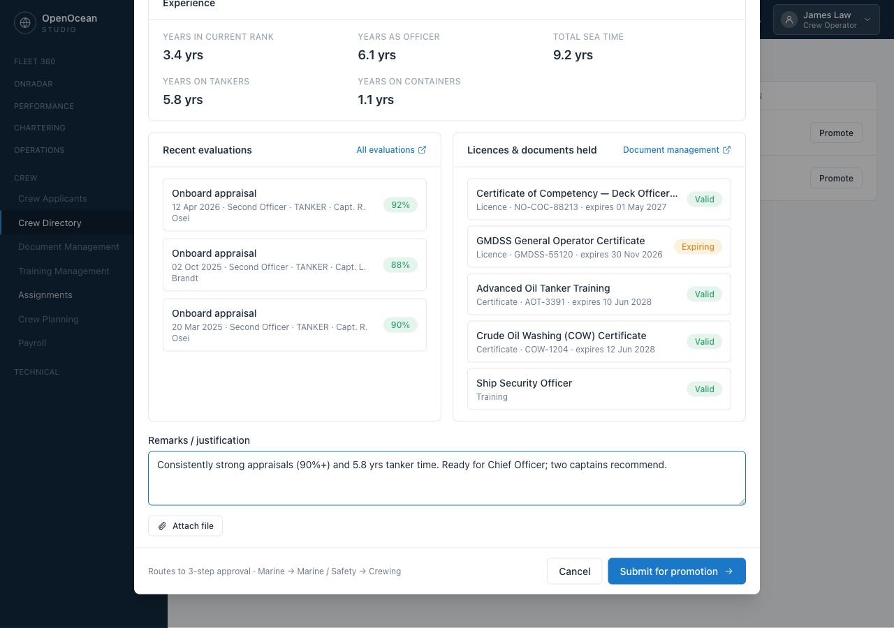
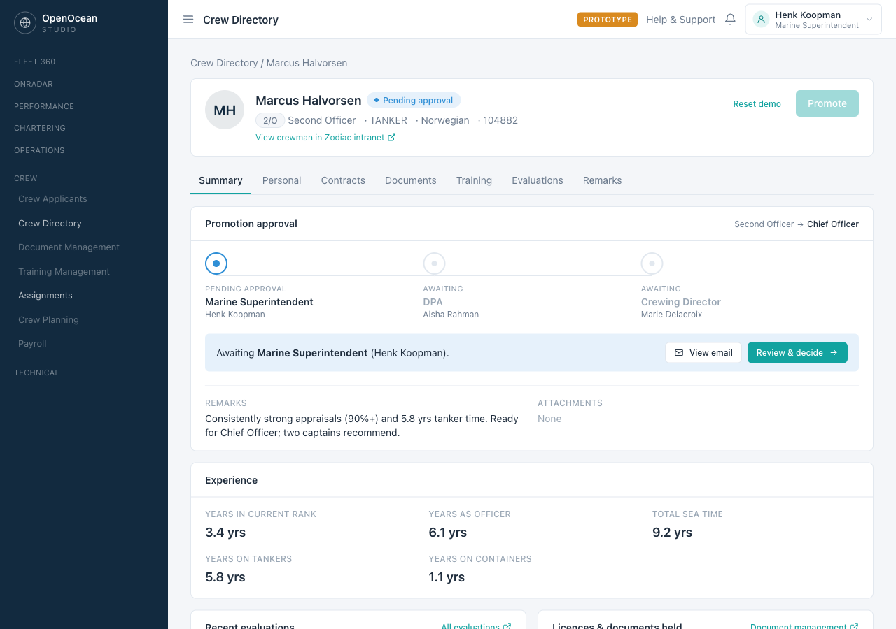
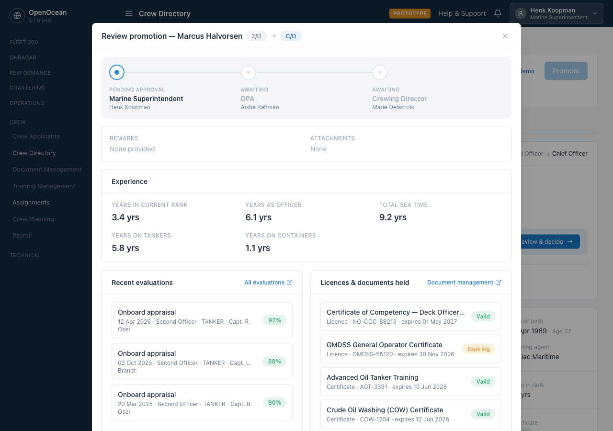
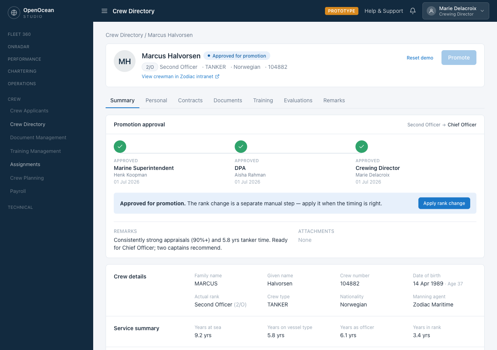

# Seafarer Promotion Management — Prototype

A clickable prototype for **seafarer promotion management** in OpenOcean Studio (OOS).

It illustrates the pragmatic "simple version" of the capability agreed with crewing:
a pre-populated promotion form → a configurable multi-step approval workflow →
an **Approved for Promotion** state → a deliberate **manual** rank change.

> 🧪 **This is a design prototype**, not production software: mock/seed data, no
> backend, simulated email, in-memory state (a refresh resets the demo). The
> "Prototype" badge, the role switcher, and "Reset demo" buttons are demo aids.

**Repo:** <https://github.com/James1Law/promotion-management-prototype>

---

## The flow

**1 · Initiate** — from the Crew Directory, open a seafarer and click **Promote**. Every
entry point in OOS opens the *same* form, pre-populated with the decision-support data
crewing already holds: experience (with vessel-type-conditional rows), recent evaluation
scores (on the OOS **1–10** scale, e.g. `9.2 / 10`), and licences/documents held — each
deep-linking to its existing module. Add remarks and an attachment, then submit.



**2 · Route & approve** — the request enters a configurable, sequential approval workflow,
shown with the same stepper OOS already uses for crew-applicant approval. Each approver is
notified by email (simulated) and can **approve / reject / pause / skip**.



Each approver opens the request in a **modal over the profile** and — only at this point —
sees the decision-support panels the initiator saw (experience, evaluations, licences,
remarks and attachments) before recording a decision. Until then the profile shows just
the workflow card and the normal summary.



**3 · Approved for promotion** — after the final approval the seafarer reaches the
**Approved for Promotion** state. The rank change is deliberately a **separate manual
step**, so the promotion is applied only when the timing is right (not automatically at
sign-on or mid-contract).



Both the **happy path** and a **rejection path** (rejected with a reason, workflow halted)
are included.

---

## Run locally

```bash
npm install
npm run dev      # → http://localhost:5173
```

Try it: open a seafarer → **Promote** → submit → use the **role switcher** (top-right),
or the "Switch to …" shortcut on the review screen, to approve as each department in turn.

## Build & deploy

```bash
npm run build    # typecheck + production build → dist/
npm run preview  # serve the production build → http://localhost:4173
```

Deploys as a static SPA on **Vercel** (framework auto-detected as Vite; `vercel.json`
provides an SPA-rewrite fallback). Output directory: `dist/`.

## Tech

Vite · React 18 · TypeScript · Tailwind CSS v4 · react-router · zustand.

The prototype is **config-driven** so it's easy to extend: the approval workflow, the
form's experience rows, the rank ladder and the seed seafarers are all declared as data.
Changing behaviour means editing a config file in [`src/data/`](src/data), not rewriting
components.

## Docs

- **Requirements** — [`notes/prototype-prd.md`](notes/prototype-prd.md)
- **Architecture & how to extend** — [`CLAUDE.md`](CLAUDE.md)
- **Long-term vision** (out of scope for this prototype) — [`notes/full-solution-proposal.md`](notes/full-solution-proposal.md)
